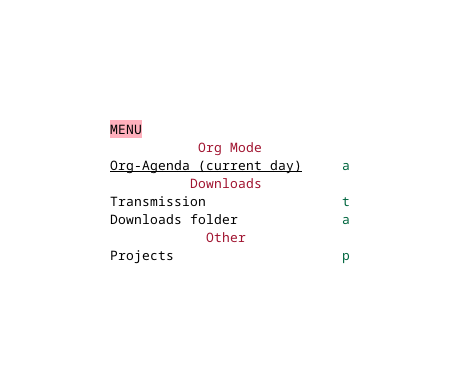

<p align="center">
# `enlight`
Highly customizable startup screen for Emacs.


</p>

## Installation and configuration

``` elisp
(use-package enlight
  :init
  (unless (package-installed-p 'enlight)
    (package-vc-install
     '(enlight
       :vc-backend Git
       :url "https://github.com/ichernyshovvv/enlight"
       :branch "master"))))
```

## Usage

You can set `initial-buffer-choice` custom variable to #'enlight in
order to show enlight right after Emacs startup:

``` elisp
(setopt initial-buffer-choice #'enlight)
```

Also you always can switch to the buffer by calling

```
M-x enlight-open
```

## Configuration examples and screenshots

### Simple menu

<p align="center"></p>

``` elisp
(use-package enlight
  :custom
  (enlight-content
   (concat
    (propertize "MENU" 'face 'highlight)
    "\n"
    (enlight-menu
     '(("Org Mode"
	("Org-Agenda (current day)" (org-agenda nil "a") "a"))
       ("Downloads"
	("Transmission" transmission "t")
	("Downloads folder" (dired "~/Downloads") "a"))
       ("Other"
	("Projects" project-switch-project "p")))))))
```

### Using grid.el

Use can use grid.el to construct a bit more complex layouts.

``` elisp
(use-package grid
  :init
  (unless (package-installed-p 'grid)
    (package-vc-install
     '(grid
       :vc-backend Git
       :url "https://github.com/ichernyshovvv/grid.el"
       :branch "master"))))

(defvar enlight-lipsum "Lorem ipsum dolor sit amet, consectetur adipiscing elit, sed do eiusmod tempor incididunt ut labore et dolore magna aliqua.

Ut enim ad minim veniam, quis nostrud exercitation ullamco laboris nisi ut aliquip ex ea commodo consequat.")

(defface enlight-yellow-bold
  '((t (:foreground "#cabf00" :bold t)))
  "Yellow bold face")

(defvar enlight-guix
  (propertize
   " ..                             `.
 `--..```..`           `..```..--`   
   .-:///-:::.       `-:::///:-.     
      ````.:::`     `:::.````        
           -//:`    -::-             
            ://:   -::-              
            `///- .:::`              
             -+++-:::.               
              :+/:::-                
              `-....`                "
   'face 'enlight-yellow-bold))

(defvar enlight-guix-widget
  `( :content ,(concat "\n" (propertize "Block 1" 'face 'enlight-yellow-bold)
		       "\nGUIX MANAGEMENT WIDGET\n\n")
     :width 22 :border t :align center :padding 2))

(defvar enlight-email-width
  `( :content
     ,(concat "\n" (propertize "Block 2" 'face 'enlight-yellow-bold)
	      "\nEMAIL WIDGET\n\n")
     :padding 2 :width 22 :align center :border t))

(defvar enlight-weather-width
  `( :content
     ,(concat "\n" (propertize "Block 3" 'face 'enlight-yellow-bold)
	      "\nWEATHER WIDGET\n\n")
     :padding 2 :width 22 :border t :align center))

(defvar enlight-calendar
  (progn
    (calendar)
    (diary-mark-entries)
    (prog1 (with-current-buffer (buffer-name (current-buffer))
	     (buffer-string))
      (calendar-exit))))

(use-package enlight
  :custom
  (enlight-content
   (concat
    (grid-get-box `( :align center :content ,enlight-guix :width 80))
    (grid-get-row
     (list
      (grid-get-box
       (concat
	(grid-get-box
	 `( :content
	    ,(concat
	      (grid-get-box `( :content ,(propertize "HEADER" 'face 'highlight)
			       :width 80 :align center))
	      (grid-get-row
	       `(,enlight-guix-widget
		 "     "
		 ,enlight-email-width
		 "     "
		 ,enlight-weather-width)))
	    :width 80))
	enlight-calendar "\n"
	(grid-get-row
	 `(,(concat
	     (propertize "MENU" 'face 'highlight)
	     "\n"
	     (enlight-menu
	      '(("Org Mode"
		 ("Org-Agenda (current day)" (org-agenda nil "a") "a"))
		("Downloads"
		 ("Transmission" transmission "t")
		 ("Downloads folder" (dired "~/Downloads") "a"))
		("Other"
		 ("Projects" project-switch-project "p")))))
	   ,(grid-get-column
	     `(,(propertize "THINGS TO REMEMBER" 'face 'highlight)
	       (:content ,enlight-lipsum :width 50))))))))))))
```


Thanks to @a13 and @progfolio for code review.
